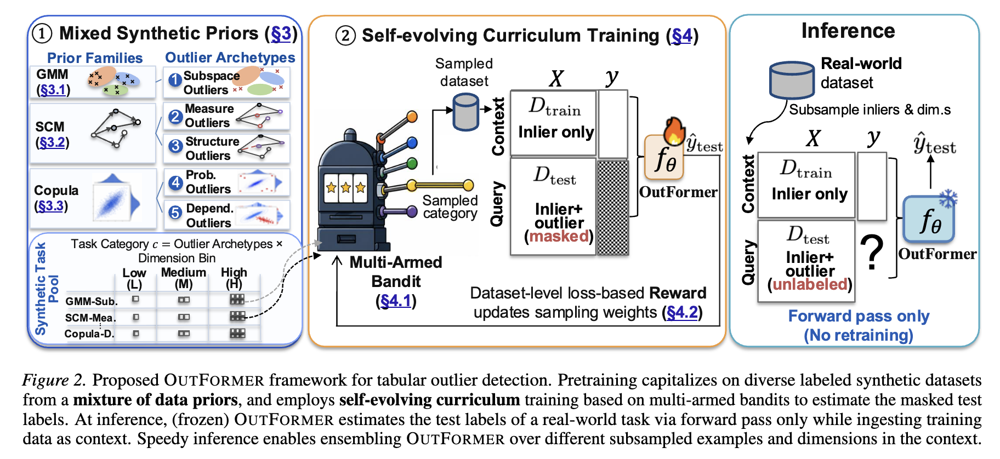

# OutFormer: From Zero to Hero: Advancing Zero-Shot Foundation Models for Tabular Outlier Detection

[](https://arxiv.org/abs/2602.03018)
[](https://www.python.org/)
[](https://pytorch.org/)
[](https://huggingface.co/datasets/MacrOData-CMU/OddBench)
[](https://huggingface.co/datasets/MacrOData-CMU/OvRBench)
[](https://huggingface.co/MacrOData-CMU/OutFormer/tree/main)

A zero-shot foundation model for tabular outlier detection. OutFormer is pretrained only on
labeled synthetic data drawn from a mixture of priors (GMMs, structural causal models and
copulas), using a self-evolving curriculum that picks which tasks to train on with a
multi-armed bandit. On a new dataset it labels outliers with a single forward pass, with no
labels and no retraining. Accepted at ICML 2026.



## Installation

Create the `outformer` conda environment from [environment.yml](environment.yml):

```bash
conda env create -f environment.yml
conda activate outformer
```

The environment uses conda-forge only. If conda stops with a Terms of Service error for
`repo.anaconda.com`, use this instead:

```bash
conda create --override-channels -c conda-forge --file environment.yml
```

PyTorch is installed from PyPI, and the Linux wheels include the CUDA runtime, so you don't
need a separate CUDA toolkit. You still need a GPU with an NVIDIA driver for training.

## Benchmarks

Outformer is evaluated on three tabular outlier-detection benchmarks. OddBench and OvRBench
were introduced with the paper,
[From Zero to Hero: Advancing Zero-Shot Foundation Models for Tabular Outlier Detection](https://arxiv.org/abs/2602.03018).
Download the datasets into `benchmarks/`, which git ignores.

| Benchmark | Datasets | What it contains |
|---|---|---|
| [ADBench](https://github.com/Minqi824/ADBench) | 57 | The established outlier-detection benchmark: classical tabular datasets, plus image and text datasets turned into feature vectors with pretrained encoders |
| [OddBench](https://huggingface.co/datasets/MacrOData-CMU/OddBench) | 690 | Real-world tables from Tablib whose metadata marks semantic anomalies such as fraud, failure or defect |
| [OvRBench](https://huggingface.co/datasets/MacrOData-CMU/OvRBench) | 755 | Classification benchmarks (TabArena, TabRepo, TabZilla and others) recast as outlier detection: one class is kept as inliers and the other classes are subsampled as outliers |

### OddBench and OvRBench

Both are hosted on Hugging Face under [MacrOData-CMU](https://huggingface.co/MacrOData-CMU).
The `hf` command comes with `huggingface_hub`, which is part of the `outformer` environment.

```bash
hf download MacrOData-CMU/OddBench --repo-type dataset --local-dir benchmarks/oddbench
hf download MacrOData-CMU/OvRBench --repo-type dataset --local-dir benchmarks/ovrbench
```

Each repo has two folders. `public/` holds the full benchmark (about 0.5 GB for OddBench and
2.2 GB for OvRBench, including both folders), and `representative/` holds a 50-dataset subset.
To download only the subset, add `--include "representative/*"`.

Each `.npz` file is already split into `train` and `test`, with labels in `train_labels` and
`test_labels`. It also holds metadata such as `anomaly_fraction` and `feature_count`.

### ADBench

ADBench keeps its datasets in its GitHub repository (about 2 GB). This clones only the dataset
folder and copies it into place:

```bash
git clone --depth 1 --filter=blob:none --sparse https://github.com/Minqi824/ADBench.git /tmp/ADBench
git -C /tmp/ADBench sparse-checkout set adbench/datasets
mkdir -p benchmarks/adbench
cp -r /tmp/ADBench/adbench/datasets/{Classical,CV_by_ResNet18,CV_by_ViT,NLP_by_BERT,NLP_by_RoBERTa} benchmarks/adbench/
rm -rf /tmp/ADBench
```

Keep the subfolders. The two CV folders use the same file names (for example
`CIFAR10_0.npz`), and so do the two NLP folders. Each `.npz` file has a feature matrix `X` and
labels `y` (1 = anomaly).

## Pretraining

Run from the repository root:

```bash
python pretrain.py
```

[Hydra](https://hydra.cc) assembles the settings from
[config/pretrain_config.yaml](config/pretrain_config.yaml), which combines three files:

| Group | File | Controls |
|---|---|---|
| `train` | [config/train/cl_trainer.yaml](config/train/cl_trainer.yaml) | Model size, optimisation, GPUs, checkpoints, logging |
| `prior` | [config/prior/mixture.yaml](config/prior/mixture.yaml) | Synthetic data priors (GMM, SCMs) |
| `test` | [config/test/default.yaml](config/test/default.yaml) | Evaluation settings |

There are two ways to change a setting.

**Edit the YAML file.** This changes the default for every run. For example, to train on 4
GPUs, set this in `config/train/cl_trainer.yaml`:

```yaml
num_device: 4
```

**Pass it on the command line.** This changes only that run. Use `group.key=value`, where
`group` is `train`, `prior` or `test`:

```bash
# 4 GPUs, larger batch, shorter run
python pretrain.py train.num_device=4 train.batch_size=8 train.epochs=500

# smaller model
python pretrain.py train.nlayer=6 train.emsize=256 train.nhid=512

# nested prior settings use dots
python pretrain.py prior.mixture.gmm.max_num_cluster=8
```

Hydra rejects keys that don't exist in the config. To add a new key, prefix it with `+`, as in
`+train.new_key=value`. To print the merged config without training, run
`python pretrain.py --cfg job`.

Commonly changed settings in `cl_trainer.yaml`:

| Key | Default | Meaning |
|---|---|---|
| `num_device` | `1` | Number of GPUs; training uses DDP across them |
| `batch_size` | `2` | Batch size per GPU |
| `epochs` | `1500` | Number of training epochs |
| `steps_per_epoch` | `1000` | Steps per epoch |
| `lr` | `1e-4` | Learning rate |
| `seq_len` | `5000` | Context length: rows drawn per synthetic dataset |
| `emsize`, `nhid`, `nhead`, `nlayer` | `512`, `1024`, `8`, `10` | Transformer width, feed-forward size, heads, layers |
| `seed` | `0` | Random seed |
| `model_dir` | `'ckpt'` | Where checkpoints are saved |
| `extra_heading` | `''` | Prefix added to the run name, to tell runs apart |
| `resume_from_ckpt` | `False` | Resume from `last.ckpt` of a run with the same settings |
| `logging` | `False` | Log to Weights & Biases (run `wandb login` first) |

Checkpoints go to `<model_dir>/<run name>/seed<seed>/`. The run name is built from the main
settings, such as `context5000.feat100.R500...ndevice1`. To resume a run with `resume_from_ckpt=True`,
use the same settings as the original run so the path matches.

On Slurm, request as many GPUs as `num_device`:

```bash
srun -p advanced --gres=gpu:4 --cpus-per-task=32 --mem=256G --time=08:00:00 \
    python pretrain.py train.num_device=4
```
